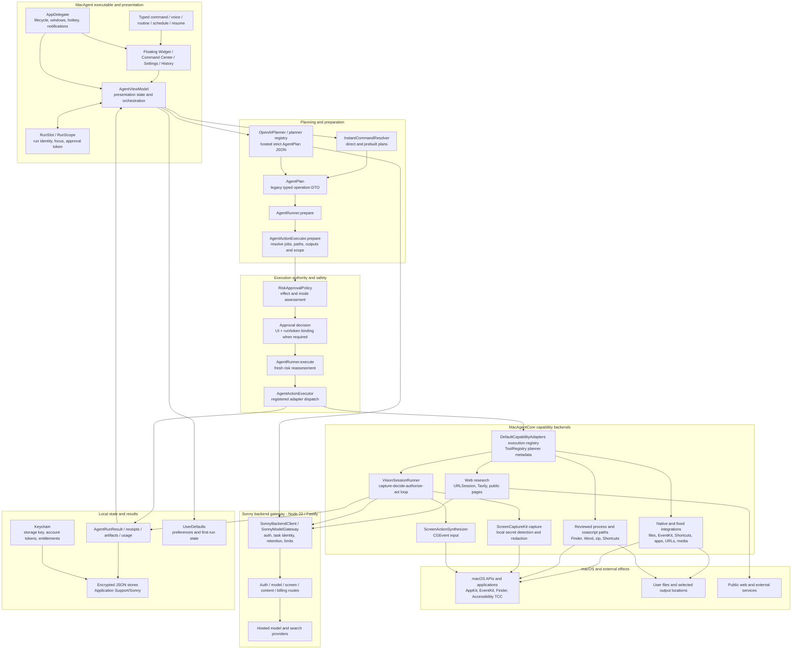
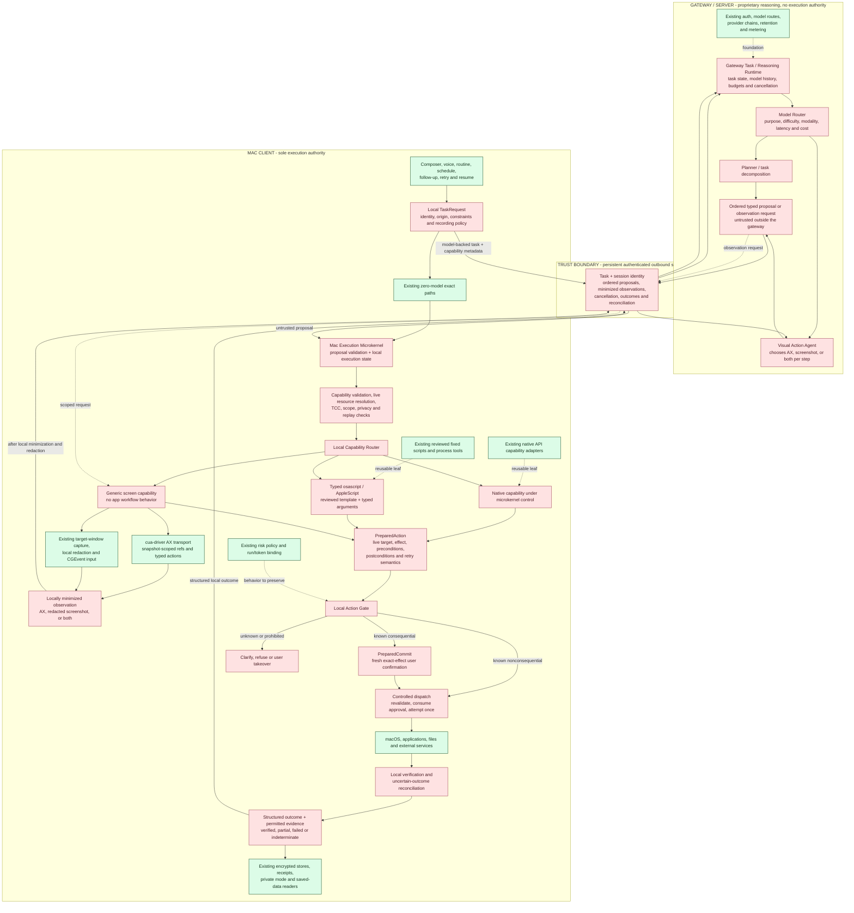

# Sonny architecture diagrams

These diagrams separate the architecture that exists on `main` from the V2 target and its current
implementation progress. They are architectural maps rather than class diagrams: a box may represent
several concrete types when they share one responsibility.

## Current architecture on main

Snapshot: `main` at `482633c3` on 2026-09-25.

The important current boundary is that the Mac owns the agent loop and side effects. The server
holds provider credentials and mediates hosted model calls, while executable capabilities remain
registered Swift implementations. Model output, web content and observed UI text are untrusted;
approval and local execution authority stay in the app.

This is a current-state snapshot, not the approved V2 boundary. V2 moves proprietary reasoning,
planning, model routing and Visual Action Agent state to the gateway while retaining all execution
authority in the Mac microkernel, as shown below.

Primary implementation evidence:

- [`Sources/MacAgent/AppDelegate.swift`](../Sources/MacAgent/AppDelegate.swift) and
  [`Sources/MacAgent/AgentViewModel.swift`](../Sources/MacAgent/AgentViewModel.swift)
- [`Sources/MacAgentCore/AgentRunner.swift`](../Sources/MacAgentCore/AgentRunner.swift),
  [`Sources/MacAgentCore/AgentActionExecutor.swift`](../Sources/MacAgentCore/AgentActionExecutor.swift), and
  [`Sources/MacAgentCore/RiskApproval.swift`](../Sources/MacAgentCore/RiskApproval.swift)
- [`Sources/MacAgentCore/DefaultCapabilityAdapters.swift`](../Sources/MacAgentCore/DefaultCapabilityAdapters.swift)
  and [`Sources/MacAgentCore/VisionSessionRunner.swift`](../Sources/MacAgentCore/VisionSessionRunner.swift)
- [`Sources/MacAgentCore/LocalStorageEncryption.swift`](../Sources/MacAgentCore/LocalStorageEncryption.swift)
  and [`Sources/MacAgentCore/LocalStoreClassification.swift`](../Sources/MacAgentCore/LocalStoreClassification.swift)
- [`server/src/app.ts`](../server/src/app.ts) and [`server/src/routes/model.ts`](../server/src/routes/model.ts)

## V2 target and implementation status

Plan source: [`sonny_v2_architecture_implementation_plan.md`](../sonny_v2_architecture_implementation_plan.md).
Implementation status was checked against `origin/feature/v2-milestone-a-whatsapp-draft` at
`3a852b18` on 2026-09-25.

The branch name and the root plan still describe a WhatsApp draft, but the branch's current plan and
code changed Milestone A to a **new note in Notes** after measuring WhatsApp, Messages, Mail and
Telegram. That branch proves useful CUA transport and observation seams, but it puts Notes workflow
behavior in the runtime. Notes must instead be only a fixture used to prove an app-agnostic screen
controller.

The corrected target has **one gateway reasoning service, one Mac execution authority, one explicit
session boundary, three execution surfaces, and one local action gate**:

- The **model router** selects the cheapest eligible model tier for the reasoning purpose, difficulty,
  modality, latency and remaining budget. An exact local command still uses no model. A model such as
  GPT-6 Luna can occupy the low-cost interaction tier without becoming an architectural dependency.
  Model routing, planning, Visual Action Agent context and reasoning history stay on the gateway.
- The **persistent session** is opened outbound by the Mac. It carries scoped requests, ordered
  proposals, minimized observations, cancellations and structured outcomes; it is not a remote-control
  channel that grants the gateway local authority.
- The **Mac execution microkernel** validates every proposal and independently chooses an available
  native API, reviewed typed osascript/AppleScript template, or generic screen tool according to live
  support, permissions, scope and verification quality.
- The gateway **Visual Action Agent** may request AX, a redacted screenshot, or both for each step. The
  Mac screen capability collects and releases only locally permitted observations and executes only
  actions accepted by the microkernel.
- Every mutating backend produces a `PreparedAction` and crosses the same local **action gate**.
  Gateway models, AX labels and screenshots may inform a proposal but cannot authorize it. Known
  consequential effects such as send, delete, purchase, credential submission or destructive overwrite
  require fresh confirmation of the actual effect. Unknown effects stop rather than being assumed safe.

Green means the precisely labelled capability exists on the feature branch or is reusable from
`main`. Red means that part of the corrected V2 target does not. Green does not imply that an existing
component has already been migrated under the final shared V2 authority.

### Input, model and interaction combinations

This view shows the routing combinations without implying fixed lanes. Every Mac input becomes the
same local `TaskRequest`. Exact zero-model work stays on the Mac; model-backed work crosses the
persistent session to a gateway-selected model tier. Every returned proposal is validated by the Mac,
whose local capability router independently chooses an execution surface. The gateway Visual Action
Agent can request AX, screenshots, or both during the same task.

```mermaid
flowchart LR
    subgraph Inputs["MAC CLIENT - INPUT"]
        Typed["Typed composer"]
        Voice["Voice command"]
        Direct["Direct UI action"]
        Routine["Routine"]
        Schedule["Schedule"]
        Followup["Follow-up / retry"]
        Resume["Resumed task"]
    end

    Request["LOCAL TASK REQUEST<br/>identity + constraints + scope"]

    Typed --> Request
    Voice --> Request
    Direct --> Request
    Routine --> Request
    Schedule --> Request
    Followup --> Request
    Resume --> Request

    FastPath["MAC ZERO-MODEL PATH<br/>exact instant or typed operation"]
    Session["PERSISTENT OUTBOUND SESSION<br/>the server/client trust boundary"]

    subgraph ModelChoice["GATEWAY / SERVER - REASONING"]
        ModelRouter["MODEL ROUTER<br/>purpose + difficulty + modality<br/>latency + budget + progress"]
        CheapModel["Low-cost model<br/>simple planning or grounded CUA step"]
        StandardModel["Standard model<br/>multi-step planning or ambiguity"]
        StrongModel["Strong / multimodal model<br/>hard reasoning or visual escalation"]
        Proposal["UNTRUSTED INTENT / ACTION PROPOSAL"]
        VisualAgent["VISUAL ACTION AGENT<br/>goal + permitted evidence + action history"]

        ModelRouter --> CheapModel
        ModelRouter --> StandardModel
        ModelRouter --> StrongModel
        CheapModel --> Proposal
        StandardModel --> Proposal
        StrongModel --> Proposal
        ModelRouter --> VisualAgent
        VisualAgent --> Proposal
    end

    Request --> FastPath
    Request --> Session --> ModelRouter

    Intent["MAC VALIDATION<br/>scope + capability + live resources + TCC"]
    FastPath --> Intent
    Proposal --> Session --> Intent

    ExecutionRouter["MAC CAPABILITY ROUTER<br/>support + permission<br/>effect + verification quality"]
    Intent --> ExecutionRouter

    subgraph Targets["MAC CLIENT - EXECUTION CAPABILITY"]
        NativeTarget["Native APIs<br/>files, EventKit, Shortcuts and app APIs"]
        ScriptTarget["Typed osascript / AppleScript<br/>reviewed template + typed arguments"]
        ScreenTarget["Generic screen controller<br/>resolved app + window + goal"]
    end

    ExecutionRouter --> NativeTarget
    ExecutionRouter --> ScriptTarget
    ExecutionRouter --> ScreenTarget

    subgraph ScreenModes["MAC SCREEN TOOLS - requested again each step"]
        AXMode["AX semantic tool<br/>tree observation + typed AX action"]
        VisualMode["Screenshot tool<br/>redacted pixels + coordinate action"]
        HybridMode["Combined tools<br/>AX semantics + screenshot grounding"]
    end

    ScreenTarget -->|capabilities + minimized observation| Session
    Session --> VisualAgent
    VisualAgent -->|typed screen-tool request| Session
    Session --> AXMode
    Session --> VisualMode
    Session --> HybridMode
    AXMode -. fresh minimized observation .-> Session
    VisualMode -. fresh redacted observation .-> Session
    HybridMode -. fresh combined observation .-> Session

    Prepared["PREPARED ACTION<br/>exact target + effect + expected result"]
    NativeTarget --> Prepared
    ScriptTarget --> Prepared
    AXMode --> Prepared
    VisualMode --> Prepared
    HybridMode --> Prepared

    Gate["ONE LOCAL ACTION GATE"]
    Auto["Known nonconsequential<br/>execute and verify"]
    Confirm["Known consequential<br/>show exact effect and confirm"]
    Stop["Unknown or prohibited<br/>clarify, refuse or hand over"]

    Prepared --> Gate
    Gate --> Auto
    Gate --> Confirm
    Gate --> Stop

    classDef input fill:#E0F2FE,stroke:#477A99,color:#173247,stroke-width:1.5px;
    classDef routing fill:#F3E8FF,stroke:#8064A2,color:#342044,stroke-width:1.5px;
    classDef model fill:#FEF3C7,stroke:#A9843F,color:#493817,stroke-width:1.5px;
    classDef target fill:#DCFCE7,stroke:#4D7C5A,color:#17351F,stroke-width:1.5px;
    classDef gate fill:#F1F5F9,stroke:#64748B,color:#243244,stroke-width:1.5px;
    classDef allowed fill:#DCFCE7,stroke:#4D7C5A,color:#17351F,stroke-width:1.5px;
    classDef confirm fill:#FFEDD5,stroke:#B7793E,color:#4A2B14,stroke-width:1.5px;
    classDef blocked fill:#FEE2E2,stroke:#B76E79,color:#4A1D24,stroke-width:1.5px;

    class Typed,Voice,Direct,Routine,Schedule,Followup,Resume input;
    class Request,FastPath,Session,Intent,ExecutionRouter,Prepared routing;
    class ModelRouter,CheapModel,StandardModel,StrongModel,Proposal,VisualAgent model;
    class NativeTarget,ScriptTarget,ScreenTarget,AXMode,VisualMode,HybridMode target;
    class Gate gate;
    class Auto allowed;
    class Confirm confirm;
    class Stop blocked;
```

The routing dimensions are independent. For example, a voice request can resolve with no model and
use a native API; a scheduled request can use the standard planning tier and a typed script; a typed
request can use the low-cost tier while the Visual Action Agent alternates between AX and screenshots;
and a hard resumed task can escalate to the multimodal tier while still using AX for the final action.
Model escalation never changes the approval requirement, and changing screen tools never bypasses
the action gate.

### Where the current feature branch is coupled incorrectly

| Area | Current feature-branch behavior | Required correction |
|---|---|---|
| Runtime | `SupportedApp.notes` owns `com.apple.Notes`, File > New Note, default-folder recovery and note-specific progress | Gateway reasoning remains app-agnostic; the Mac microkernel receives typed proposals and locally resolves the app/window |
| Goal/schema | `interactionGoal`, `interactionTarget` and `interactionText` encode a target-plus-text workflow | Use typed operations or a generic interaction goal with outcome, constraints, allowed effects and completion criteria |
| Observation | Candidate filtering and value states assume chats, folders and text placement | Build bounded AX/image observations according to the current goal and privacy policy, without an app workflow |
| Policy | Commit-word lists and role heuristics refuse the Milestone A danger set | Prepare an effect-bearing action and apply one deterministic policy gate across native, script, AX and visual actions |
| Verification | Success is exact text found in an eligible field | Verify goal-specific postconditions with the strongest available native, AX or visual evidence |
| CUA scope | Manifest allows only `com.apple.Notes`; screenshot input is disabled | Pin a dynamically resolved target app/window and expose separately bounded AX, screenshot and input capabilities |
| Session | Stateless model requests do not provide ordered gateway-to-Mac orchestration | Add one authenticated outbound Mac session with task/session binding, sequencing, reconnect reconciliation and replay rejection |
| Models | Plan and interaction endpoints have fixed provider chains and reasoning hints | Keep planning and Visual Action Agent state on the gateway and route each reasoning request to a configured tier with bounded escalation |

The existing branch should therefore be **decomposed, not generalized by adding more app entries**.
Keep `CuaDriverClient`, snapshot-scoped references, local redaction, the gateway step route and fresh
observation checks. Remove Notes setup, folder recovery, target/text assumptions and app-specific
summaries from the core loop. A Notes fake may remain an integration fixture, but passing that fixture
must exercise the same generic controller used for every other app.

The hard safety boundary also cannot be only a prompt or blacklist. A generic unlabeled click can
still send, delete or buy something. The model may identify a likely effect, but local policy must
require exact confirmation when the effect is consequential and stop when the effect cannot be
established. This is the minimum guardrail that lets a cheap control model operate broadly without
giving it authority to approve its own actions.

Feature-branch evidence:

- `Sources/MacAgentCore/AppInteractionRuntime.swift`
- `Sources/MacAgentCore/AppInteractionGoal.swift`
- `Sources/MacAgentCore/AppInteractionPolicy.swift`
- `Sources/MacAgentCore/AppInteractionScreen.swift`
- `Sources/MacAgentCore/AppInteractionVerifier.swift`
- `Sources/MacAgentCore/CuaDriverClient.swift`
- `Sources/MacAgentCore/AppInteractionStepPrompt.swift`
- `Sources/MacAgentCore/CapabilityAdapter.swift`
- `Sources/MacAgent/AgentViewModel.swift`
- `server/src/model/provider-router.ts`
- `server/src/routes/model.ts`

Those files are on `origin/feature/v2-milestone-a-whatsapp-draft`, not yet on `main`, so they are
listed as branch paths rather than links from this branch.
